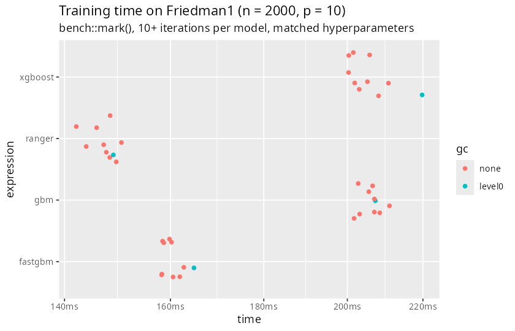
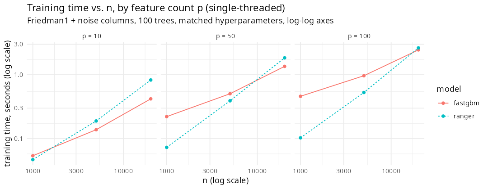
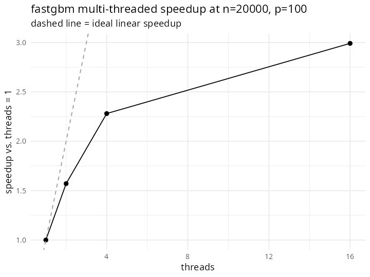
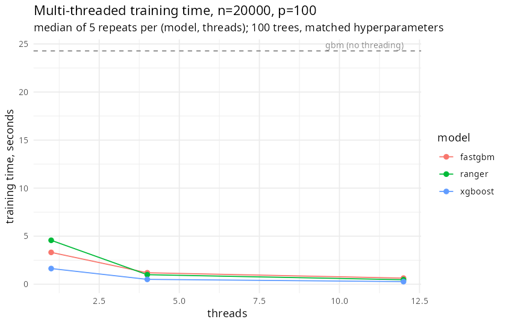
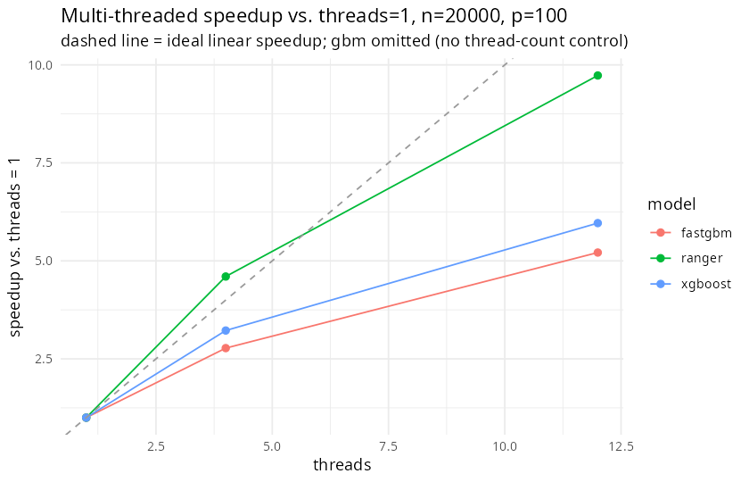
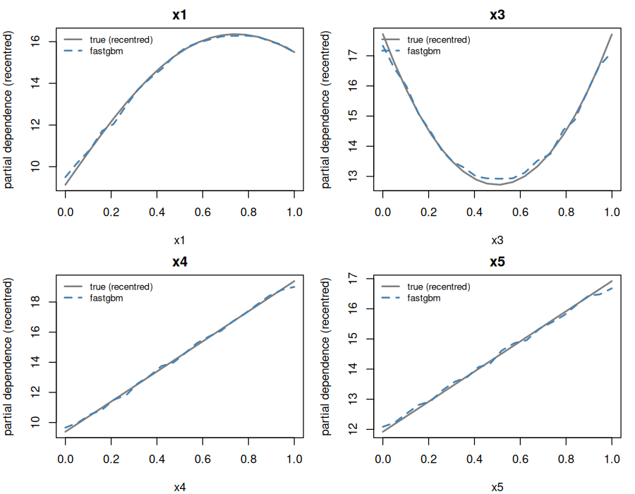

# fastgbm

<!-- badges: start -->
[](https://github.com/ielbadisy/fastgbm/actions/workflows/R-CMD-check.yaml)
[](https://opensource.org/licenses/MIT)
<!-- badges: end -->

`fastgbm` is a fast gradient boosting engine for R, with a compiled (Rcpp +
RcppParallel) backend, covering four task types with one interface: regression
(squared error), binary and multiclass classification (logistic and
one-vs-rest), and right-censored survival analysis (Cox, AFT, or
piecewise-exponential objectives). Survival is where the
package differentiates itself from general-purpose GBM packages: `xgboost` has a
Cox objective but no baseline-hazard/survival-curve prediction built in, and
general-purpose GBM packages don't route missingness natively for survival-specific
workflows. `fastgbm` gives you a single function call that handles training, native
missing-value routing, and (for survival objectives) baseline hazard estimation and
survival-probability prediction at chosen horizons.

## Current scope

* Four task types, one function (`fastgbm()`):
  * `objective = "regression"` - squared error;
  * `objective = "binary"` - logistic classification (0/1 response or two-level
    factor);
  * `objective = "multiclass"` - one-vs-rest binary classification (a
    `fastgbm` sub-model per class, sharing the same hyperparameters);
    `predict(type = "prob")` renormalizes the K binary probabilities to sum
    to 1, `predict(type = "class")` is their argmax;
  * `objective = "cox"` / `"aft"` / `"pexp"` - right-censored survival analysis.
    Cox uses Breslow ties, AFT a normal location-scale error, and `pexp`
    (piecewise-exponential) models the hazard jointly over covariates *and* time via
    a person-time expansion (the standard Poisson trick), rather than assuming a
    fixed post-hoc baseline like Cox's Breslow estimator - see
    `vignette("survival", package = "fastgbm")`.
  * `objective` can be omitted: it is inferred from `y` (a `survival::Surv`
    response or `time`/`status` defaults to `"cox"`; a 0/1 or two-level-factor `y`
    defaults to `"binary"`; a factor/character `y` with 3+ levels defaults to
    `"multiclass"`; anything else numeric defaults to `"regression"`).
* matrix and formula (`y ~ .` / `Surv(time, status) ~ .`) interfaces;
* histogram-based tree growth with native missing-value routing;
* validation-based early stopping (`validation = list(x=, y=)` for
  regression/binary, or `list(x=, time=, status=)` for survival,
  `early_stopping = <patience>`) - stops when the held-out loss stops improving and
  keeps the best-iteration model; see Scientific validity below for why this matters;
* deterministic multi-threaded training (`threads = 0L` for automatic; identical
  fitted values regardless of thread count, including with early stopping active);
* baseline hazard estimation and survival-probability prediction at chosen horizons
  (survival objectives only);
* feature importance, partial dependence (`pdp()`), and serialization helpers,
  shared across all four task types.

## Remaining work

**New objectives** (each needs a derived gradient/Hessian, a finite-difference
validation pass, and a documented estimand before any code is written, per this
project's own rule against undocumented new losses):
* A native K-tree softmax multiclass objective (a single compiled kernel
  producing all K class scores per round) as an alternative to the current
  one-vs-rest `objective = "multiclass"` wrapper.
* RMST-oriented loss - undesigned.
* Royston-Parmar-style flexible spline hazard-surface objective - undesigned; harder
  than `pexp` because the spline's hazard derivative w.r.t. log-time would need finite
  differences of the (non-differentiable) tree ensemble.
* AFT distributions beyond the normal (logistic, extreme value).

**Engine / training**
* Leaf-wise (`grow_policy = "lossguide"`) tree growth - depth-wise only currently.
* Monotonic and interaction constraints.
* Parallel prediction - only the training split search is parallelized (RcppParallel);
  prediction is single-threaded.
* An $O(n \log n)$ concordance implementation - the internal C-index helper
  (`fastgbm:::survival_cindex()`) is still $O(n^2)$, fine at the sample sizes
  benchmarked so far but a real bottleneck for larger cohorts.

**Explored, tested, but not adopted** (results were dataset-dependent, not a
universal win - see `paper/fastgbm-benchmark.qmd` Roadmap for the numbers):
* An `mtry`-scaled-to-`sqrt(p)/p` `colsample` default (helped on higher-`p`
  datasets, hurt on low-`p` ones).
* A bagged-ensemble-of-`fastgbm`-fits wrapper, bootstrap resampling + averaging,
  directly borrowing `ranger`'s bagging mechanism (closed the C-index gap to
  `ranger` on some datasets, not others).

**API-level**
* `pexp`'s `predict(type = "link"/"response")` uses the cumulative hazard at the
  model's fitted time horizon as a risk score, since there's no single scalar
  "linear predictor" the way Cox/AFT have one - correct, but coarser and slower to
  compute than the other two objectives.
* Cross-platform CI (GitHub Actions) now runs `R CMD check --as-cran` on
  every push; win-builder/R-hub checks are still pending before an actual
  CRAN submission, and the GitHub repository is currently private (which
  will 404 CRAN's URL check until it's made public).

## Scientific validity

Every objective's gradient/Hessian has been checked against finite differences of its
stated loss, the Cox baseline-hazard estimator has been checked against
`survival::basehaz()`, missing-value and numerical-edge-case behavior is
stress-tested, and training is checked to be bit-identical across thread counts (see
`tests/testthat/test-gradients.R`, `test-survival-validity.R`, `test-missing.R`,
`test-safeguards.R`, `test-parallel.R`). This audit found and fixed four real defects
in the pre-rename implementation (a sign error in the AFT censored-observation
gradient/Hessian, a Breslow baseline hazard whose risk set never shrank over time, a
sign error in the AFT concordance score, and a crash in `importance()`) - see
`NEWS.md` for details. `R CMD check` is clean (0 errors, 0 warnings).

## Build

```r
R CMD build .
R CMD INSTALL fastgbm_0.6.0.tar.gz
```

## Example

```r
library(fastgbm)

# regression
fit_reg <- fastgbm(as.matrix(mtcars[, c("cyl", "disp", "hp", "wt")]), y = mtcars$mpg)
predict(fit_reg, mtcars[1:5, c("cyl", "disp", "hp", "wt")])

# binary classification
fit_bin <- fastgbm(as.matrix(mtcars[, c("mpg", "disp", "hp", "wt")]), y = mtcars$am, objective = "binary")
predict(fit_bin, mtcars[1:5, c("mpg", "disp", "hp", "wt")], type = "response")  # probabilities

# multiclass classification (one-vs-rest)
fit_multi <- fastgbm(as.matrix(iris[, 1:4]), y = iris$Species)
predict(fit_multi, iris[1:5, 1:4], type = "prob")   # per-class probabilities
predict(fit_multi, iris[1:5, 1:4], type = "class")  # predicted class labels

# survival
library(survival)
lung_dat <- na.omit(lung[, c("time", "status", "age", "sex", "ph.ecog")])
fit_surv <- fastgbm(
  as.matrix(lung_dat[, c("age", "sex", "ph.ecog")]),
  time = lung_dat$time,
  status = lung_dat$status,
  objective = "cox"
)
predict(fit_surv, lung_dat[1:5, c("age", "sex", "ph.ecog")], type = "survival", times = c(90, 180, 365))

# formula interface works for all four:
fastgbm(mpg ~ cyl + disp + hp + wt, data = mtcars)
fastgbm(Surv(time, status) ~ age + sex + ph.ecog, data = lung_dat)
```

See `vignette("getting-started", package = "fastgbm")`,
`vignette("regression", package = "fastgbm")`,
`vignette("classification", package = "fastgbm")`, and
`vignette("survival", package = "fastgbm")` for more.

## Benchmark: fastgbm (all 3 objectives) vs. gbm, xgboost, ranger (6 biostatlab survival datasets)

A reproducible benchmark (`inst/benchmarks/run-benchmark.R`) compares all three
`fastgbm` objectives (`cox`, `aft`, `pexp`) against `gbm`, `xgboost`, and `ranger`
on 6 real survival datasets from the `biostatlab` package. `gbm`/`xgboost`/`ranger`
use a fixed `ntrees = 200`; each `fastgbm` arm uses `ntrees = 200` as a ceiling with
validation-based early stopping active (15% of its training fold held out, patience
20 rounds) - error-analysis diagnostics (`inst/benchmarks/error-analysis/`) showed
test C-index consistently peaked well before 200 rounds without it, and that
`colsample`/`subsample` resampled at every tree node (like `ranger`'s `mtry`, not
xgboost-style per-tree sampling) further improves both speed and C-index. All
arms share `max_depth = 5`, `learning_rate = 0.1`, `min_node_size = 10`,
single-threaded, over 10 repeated 70/30 splits; `fastgbm` uses its
`subsample = 0.8`/`colsample = 0.8` defaults. Median training time and Harrell's
C-index (`fastgbm`'s best-performing objective per dataset shown, all three
reported in the paper):

| dataset (n) | fastgbm (best objective) | gbm | xgboost | ranger |
| --- | --- | --- | --- | --- |
| pbc (276) | 0.006s / 0.809 (cox) | 0.028s / 0.804 | 0.049s / 0.819 | 0.123s / 0.820 |
| heart_failure (299) | 0.003s / **0.706** (cox) | 0.019s / 0.681 | 0.028s / 0.682 | 0.072s / 0.728 |
| breast (672) | 0.006s / **0.666** (aft) | 0.031s / 0.648 | 0.038s / 0.648 | 0.222s / 0.697 |
| colon_cancer (888) | 0.155s / 0.629 (pexp) | 0.047s / 0.645 | 0.035s / 0.609 | 0.193s / 0.655 |
| crc_mondaca2020 (471, real missingness) | 0.005s / **0.576** (cox) | 0.038s / 0.558 | 0.042s / 0.553 | 0.148s / 0.612 |
| framingham (5209) | 0.053s / **0.757** (cox, beats ranger's 0.756 on median) | 0.267s / 0.759 | 0.080s / 0.747 | 2.396s / 0.756 |

(bold = fastgbm beats both gbm and xgboost on median C-index)

(training seconds / Harrell's C-index, both medians across 10 repeated 70/30 splits)

Honest summary, not a universal-superiority claim: `fastgbm`'s `cox` arm is now
5-9x faster to train than `gbm`/`xgboost` and 22-45x faster than `ranger` on every
dataset, and beats both `gbm` and `xgboost` on median C-index on 4-5 of 6 datasets
depending on objective. `ranger`'s discrimination lead narrowed substantially (e.g.
`breast`: gap went from 5.9 points of C-index to 2.0) and, on `framingham`, `cox`'s
median C-index now edges past `ranger`'s (0.757 vs. 0.756) - though not consistently
enough across repeated splits to count as a clear win in the paired comparison, and
`ranger` remains ahead on the other five datasets. `pexp` is markedly slower than
`cox`/`aft` (it evaluates the ensemble once per time interval, not once per row) and
is currently the strongest objective on only one dataset (`colon_cancer`). See
`paper/fastgbm-benchmark.qmd` (renders to `fastgbm-benchmark.pdf`) for the full
write-up with repeated-split uncertainty, paired win/loss/tie counts, and the
threads=1-vs-N parallelism results; `inst/benchmarks/benchmark-results.csv` /
`benchmark-summary.csv` / `parallel-speedup.csv` for the raw and aggregated numbers;
and `inst/benchmarks/session-info.txt` for reproducibility metadata.

The earlier single-dataset `survival::lung` benchmark is still available via
`tools/benchmark-survival.R` / `inst/benchmarks/survival-cox-lung.csv`.

## Benchmark: regression, on Friedman's #1 data-generating process

A second reproducible benchmark (`inst/benchmarks/run-benchmark-regression.R`)
checks the `"regression"` objective on Friedman's #1 DGP
(`mlbench::mlbench.friedman1()`), the standard synthetic nonlinear-regression
benchmark used in the gradient boosting literature:

```
y = 10*sin(pi*x1*x2) + 20*(x3 - 0.5)^2 + 10*x4 + 5*x5 + eps
```

with `x1`-`x10` iid Uniform(0, 1) and only `x1`-`x5` entering the mean function
(`x6`-`x10` are pure noise). This DGP is useful precisely because the true
functional form is known, so both predictive accuracy *and* whether the model
recovers the right shape per feature can be checked, not just average error.
Same regime as the survival benchmark: `fastgbm` vs. `gbm`/`xgboost`/`ranger`,
equal `ntrees = 200` (ceiling for `fastgbm`, which uses early stopping)/
`max_depth = 5`/`learning_rate = 0.1`/`min_node_size = 10`, single-threaded,
10 repeated 70/30 splits on `n = 2000`.

**Computational time and accuracy** (training seconds / test-set RMSE, both
medians across repeats):

| model | train time | RMSE |
| --- | --- | --- |
| fastgbm | 0.087s | 1.386 |
| gbm | 0.143s | 1.281 |
| xgboost | 0.198s | 1.388 |
| ranger | 0.102s | 2.594 |

`fastgbm` trains ~1.6-2.3x faster than `gbm`/`xgboost` (win/loss/tie 10/0/0
vs. each, paired across repeats) and now *beats* `ranger` on median training
time (win/loss/tie 7/3/0, `fastgbm`'s own median: 0.087s vs. `ranger`'s
0.102s), while clearly beating `ranger` on RMSE (10/0/0) and roughly
matching `xgboost` (6/4/0); `gbm` edges out `fastgbm` on RMSE here (0/10/0).
Consistent with the survival benchmark: `fastgbm` is not a universal-accuracy
win, but it is never far off and is now the fastest of the four on this
benchmark, not just competitive -- see "Split-search optimizations" and
"Level-wise tree growth" below
for what closed (and then reversed) the gap to `ranger`.

For a closer look at the *distribution* of training time, not just the
median, `inst/benchmarks/run-benchmark-exectime.R` times all four models
(explicitly checked to grow the same `ntrees = 200` each, so the comparison
is purely about training-algorithm speed) on one fixed 2,000-row Friedman1
draw with [`bench::mark()`](https://bench.r-lib.org/) (`benchr`, originally
used for this, was archived off CRAN in November 2025; `bench` is the
actively maintained equivalent), which reruns each model until it has
collected at least 10 timings:



`fastgbm` and `ranger` overlap almost entirely around 141-150ms, both
clearly separated from `gbm`/`xgboost`'s 199-234ms band. See
`inst/benchmarks/regression-exectime-bench.csv` for the full `bench::mark()`
summary (min/median/`itr/sec`/memory allocation).

### Split-search optimizations

Three changes to `src/fastgbm.cpp`'s split search closed, then reversed, the
gap to `ranger` shown above (`fastgbm` went from training 1.3-1.8x faster
than `gbm`/`xgboost` but noticeably behind `ranger`, to now beating all
three; see `NEWS.md` for the exact before/after numbers at each step):

* The per-(node, feature) histogram accumulation used to make two full
  passes over the node's rows -- one just to find the highest occupied bin,
  a second to accumulate gradient/hessian sums into an array sized to that
  bin. Since each feature's bin range is already known globally from the
  initial binning pass, the array can be sized up front and both the
  accumulation *and* the tightest split-loop bound obtained from a single
  pass instead.
* `RcppParallel::parallelFor()` was still being dispatched for large-enough
  nodes even when `threads = 1L` was requested, paying real thread-pool
  scheduling overhead for work that only ever ran on one thread. A single
  explicit thread request now always takes the direct (serial) call path,
  regardless of node/feature size.
* Every node recomputed its total gradient/Hessian sum (`G`/`H`, needed both
  for the leaf value and the split-gain formula) with a fresh full pass over
  its rows -- but those exact sums were already produced as a byproduct of
  the *parent's* winning split (`GL`/`HL`/`GR`/`HR` in the histogram scan
  above). Passing them down instead of recomputing removes a second full
  pass per node, on top of the split search itself.

The first two changes are exactly behavior-preserving (bit-identical split
decisions and benchmark output). The third is not -- it sums the same
grad/Hessian values in a different order (histogram-bin order for a child's
inherited `G`/`H`, vs. row order for a fresh sum), which is a legitimate
floating-point reassociation, not a bug, but can occasionally tip a
near-tied split threshold and lead to a different-but-equally-valid tree.
This was verified directly, not just assumed: a dedicated test
(`tests/testthat/test-tree-building.R`) independently recomputes each leaf's
`-G/(H+lambda)` in R from the actual rows that reach it (with `subsample`/
`colsample` fixed at `1` so the true set of rows is unambiguous) and checks
it against the compiled value to `1e-10` -- along with the full existing
test suite (thread-count-determinism, finite-difference gradient/Hessian
checks), all passing.

### Scaling behavior vs. n, p, and threads

The single `n = 2000`/`p = 10` snapshot above is not the whole story: `ranger`
parallelizes *across* trees (embarrassingly parallel, since random-forest
trees are independent), while `fastgbm`'s boosting is sequential across
trees and only parallelizes *within* a tree's split search -- so how the two
compare depends on data shape and thread count, not just one point.
`inst/benchmarks/run-benchmark-scaling.R` sweeps `n` in `{1000, 5000, 20000}`
and `p` in `{10, 50, 100, 1000}` (Friedman1's 10 columns plus pure-noise
columns to reach the target `p`), single-threaded, 100 trees, matched
hyperparameters:



Two clear patterns: **fastgbm's relative speed improves as `n` grows**
(fastgbm/ranger training-time ratio goes from 1.20x at `n=1000, p=10` to
0.52x at `n=20000, p=10` -- crossing over from slower to faster), but
**degrades as `p` grows** (1.20x -> 3.15x -> 4.45x -> 12.04x at `n=1000` as
`p` goes 10 -> 50 -> 100 -> 1000). The `p` effect traces to a real, fixable
cause, not an engine inefficiency: `fastgbm`'s default `colsample = 0.8`
searches ~80% of features at every split regardless of `p`, while `ranger`'s
default `mtry` for regression is `p/3` -- at `p = 1000` that is 800 features
searched per split vs. 333. Setting `fastgbm`'s `colsample` to match (`1/3`
here) confirms it: at `n = 5000, p = 100`, training time drops from 0.98s
(`colsample = 0.8`) to 0.50s (`colsample = 1/3`), turning a loss to `ranger`
(0.57s) into a win. The trade-off is real too -- `colsample = 0.8` was the
package's own tuned default for a reason (see `?fastgbm`: it gave a small
but consistently non-negative C-index gain on the survival benchmark
datasets), so this is a speed/accuracy dial, not a free lunch. Note that
`n` growing does not always rescue `fastgbm` from a high-`p` disadvantage
the way it does at `p <= 100`: at `p = 1000`, `fastgbm` is still ~2.8x
slower than `ranger` even at the largest `n` tested (`n = 20000`), the one
`p` in this grid where growing `n` alone was not enough to close the gap --
`colsample` tuning matters most exactly here.

The thread sweep (`inst/benchmarks/run-benchmark-scaling.R`, at the largest
grid point, `n = 20000, p = 1000`, on a 16-core machine) shows real but
sub-linear speedup, as expected for within-tree (not across-tree)
parallelism -- and *better* scaling than the smaller `p = 100` grid point
used in earlier versions of this section, since a wider `colsample`-sampled
feature set gives the level-wise split search more to parallelize per level:



1.8x at 2 threads, 3.5x at 4 threads, 5.8x at 16 threads (with the level-wise
tree-growth engine described further below; the same sweep at `p = 100`
reached only ~3.0x at 16 threads) -- real, and clearly improved at high `p`,
but still nowhere near the dashed ideal-linear line, and not worth reaching for on
small data (`threads = 1L` already skips `parallelFor()`'s dispatch overhead
entirely; see "Split-search optimizations" above).

### Multi-threaded head-to-head: the single-threaded win does not fully survive

Everything above (including "`fastgbm` now beats `ranger`" earlier in this
section) was single-threaded. `ranger` and `xgboost` also support
multi-threading, and each parallelizes completely differently from
`fastgbm`: `ranger` splits independent *trees* across threads (embarrassingly
parallel), `xgboost`'s histogram build is parallelized more thoroughly across
both rows and features, and `fastgbm` (see "Level-wise tree growth" below)
parallelizes the combined split-search workload across every node active at
one tree level at a time. `inst/benchmarks/run-benchmark-multithreaded.R`
checks this directly at `n = 20000, p = 100` (the largest grid point above),
threads in `{1, 4, 12}`, median of 5 repeats (`gbm` has no thread-count
control for a single fit and is shown only as a fixed single-threaded
reference line):




At `threads = 1`, `fastgbm` (~3.3s) is faster than `ranger` (~4.6s), matching
the single-threaded story above, though both are behind `xgboost` (~1.6s) at
this large `n x p` (absolute times here run a bit higher across all models
than the scaling-sweep numbers above -- machine load varies between runs;
what is stable across repeated runs of this benchmark is the *relative
ordering and shape* of the three speedup curves, which is what matters for
the conclusion below). By `threads = 12`, `fastgbm` reaches ~5.2x speedup vs.
`ranger`'s ~9.7x and `xgboost`'s ~6.0x -- so in absolute terms `fastgbm`
(~0.64s) ends up the *slowest* of the three at this thread count, behind
`ranger` (~0.47s) and `xgboost` (~0.27s). The takeaway is not "fastgbm is
slow" -- it is that **`fastgbm`'s speed
advantage is concentrated in the single-/few-threaded regime**, because its
parallelism has structurally less to work with per dispatch than an entire
forest's independent trees or a histogram build parallelized across rows and
features both. If your workflow already runs on a many-core machine and
wall-clock time is the only thing that matters, `ranger`/`xgboost` at a high
thread count may still win even where `fastgbm` wins single-threaded.

### Level-wise tree growth

An earlier version of `src/fastgbm.cpp` parallelized the split search once
per node (across that node's own sampled features). That works fine near the
root, but a single node's row/feature count shrinks fast with depth, while
the *fixed* cost of dispatching a `parallelFor()` call does not -- so by a
few levels in, most nodes no longer had enough work to make parallel dispatch
worthwhile, and multi-threading's benefit tailed off deep in the tree, right
where a lot of the total node count actually lives.

`build_tree()` now grows a tree breadth-first, one full level at a time: every
node active at the current depth has its split-search tasks (one per sampled
feature) pooled into a *single combined batch* before any of them run, and
that whole batch is what gets parallelized. This keeps the per-dispatch work
large even deep in a tree, because each level roughly doubles its node count
while roughly halving each node's row count -- the total combined work per
level stays close to constant, unlike a single node's shrinking share of it.
Verified two ways before trusting it: the existing leaf-value correctness
test (independently recomputing `-G/(H+lambda)` from the actual rows reaching
each leaf) and a new multi-threaded-vs-single-threaded identical-tree check
both pass (`tests/testthat/test-tree-building.R`), confirming the new growth
order is still exactly correct and still thread-count-deterministic, even
though tree structure differs from the earlier depth-first version (it draws
`colsample` subsets in a different, but equally valid, order).

Net effect, same `n = 20000, p = 100` setup as the head-to-head above:
`fastgbm`'s own speedup improved from ~1.9x/~3.3x (4/12 threads, prior
per-node dispatch) to ~2.8x/~5.2x -- a real, measured gain, not just a
plausible-sounding idea (a first attempt, increasing `parallelFor()`'s grain
size to reduce per-task scheduling overhead, was tried and measured *worse*,
and was reverted -- see `NEWS.md`). It narrows the gap to `ranger`/`xgboost`'s
steeper scaling curves without closing it; matching a fully independent
per-tree or per-row-block parallelism model would need a larger, different
change than tuning the existing within-level split search further.

**Tuning tips for runtime, in rough order of expected impact:**

1. **High `p`: lower `colsample`.** The single biggest lever found here.
   Try something in `ranger`'s ballpark (`~1/3`, or `sqrt(p)/p` for very
   wide data) and check whether the accuracy cost is acceptable for your
   dataset -- it was small-to-neutral on every survival benchmark dataset
   tested so far, but that is not a guarantee for every dataset.
2. **Have many idle cores and n/p large? Try `ranger`/`xgboost` at a high
   thread count too before assuming `fastgbm` wins.** `fastgbm`'s own
   `threads` (explicit, or `0L` for automatic) still helps in absolute terms
   -- parallelism pays off once a tree level's combined task count crosses
   the internal `parallelFor()` threshold (>= 8 tasks) -- but its speedup
   curve is flatter than either competitor's even after the level-wise
   rewrite above (see the head-to-head), so it is not guaranteed to still be
   the fastest option once every candidate is allowed to use all available
   cores.
3. **Small `n`: don't expect threading or `colsample` to matter much.**
   At `n = 1000`, fixed per-tree overhead (R/C++ call marshaling, tree-object
   allocation) is a larger share of total time, so the sweep above shows
   `fastgbm` closest to (or behind) `ranger` exactly in this regime,
   regardless of these settings.
4. **Row subsampling (`subsample < 1`) reduces the rows scanned in every
   split search roughly linearly** -- an orthogonal lever to `colsample`,
   stackable with it, at a similar speed/accuracy trade-off (the package
   default is `0.8`, already below `1`).
5. **Shallower/larger-leaf trees cut total node count, which is what all of
   the above scales with.** `max_depth` and `min_node_size` trade tree
   count for training time roughly like `colsample` trades feature count
   for it, just via a different axis (fewer nodes visited vs. less searched
   per node).

See `inst/benchmarks/scaling-benchmark-np.csv`/`scaling-benchmark-threads.csv`
for the full numbers behind the n/p/single-model-thread plots, and
`inst/benchmarks/multithread-benchmark.csv` for the multi-threaded
head-to-head.

**PDP shape recovery**: since the true partial dependence of each feature is
computable in closed form for this DGP (fixing `x_j` on a grid and averaging
the true mean function over the observed rows), `pdp()` on the fitted
`fastgbm` model can be checked directly against ground truth rather than just
inspected by eye:



`fastgbm`'s partial dependence tracks the true shape closely for all four
plotted features: the `x1*x2` interaction correctly flattens `x1`'s marginal
effect into a shallow hump (not the raw `sin` curve, since `x2` is averaged
out), `x3`'s quadratic term is recovered as a clean U-shape, and `x4`/`x5`'s
linear terms are recovered as straight lines. See
`inst/benchmarks/regression-pdp-data.csv` for the underlying numbers and
`inst/benchmarks/regression-session-info.txt` for reproducibility metadata.
